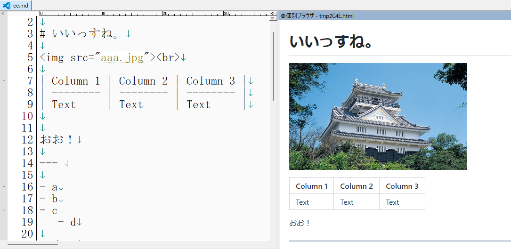

# HmMarkdownSimpleServer

## 概要

**HmMarkdownSimpleServer** は、秀丸エディタのブラウザ枠を利用してMarkdownファイルをリアルタイムでプレビューするための拡張機能です。

編集中はリアルタイムに、保存時には即座にプレビューが更新されるため、スムーズな執筆体験を提供します。

## 主な機能

*   **ハイブリッド更新モード**:
    *   **リアルタイムプレビュー**: 編集中のテキストに追従して、入力と同時にプレビューが更新されます。
    *   **保存時更新 (ライブビュー)**: ファイルを保存したタイミングでプレビューが更新されます。
    *   テキストの長さに応じて、これらのモードは自動的に切り替わります。
*   **多彩な表現力**:
    *   **GitHub Flavored Markdown**: [Markdig](https://github.com/xoofx/markdig)ライブラリにより、GFMの構文をサポートします。
    *   **Mermaid**: `mermaid`コードブロックでダイアグラムやフローチャートを記述できます。
    *   **MathJax**: `math`コードブロックや`$$...$$`構文で数式を美しく表示します。
*   **秀丸エディタとの連携**:
    *   **テーマ連動**: 秀丸エディタのライトモード/ダークモード設定に追従して、プレビューのテーマが自動で切り替わります。
    *   **フォント設定**: 秀丸エディタで設定されているフォントをプレビューにも反映します。
    *   外部のCSSファイルを読み込んで、デザインをカスタマイズすることも可能です。

## 仕組み

本拡張機能は、2つのコンポーネントが連携して動作します。

1.  `HmMarkdownSimpleServer.dll`:
    秀丸エディタで開かれているMarkdownファイルを監視するCOMコンポーネントです。ファイルが保存されると、その内容を読み取り、Markdigライブラリを使ってHTMLに変換し、一時ファイルとして出力します。
2.  `HmMarkdownListeningServer.dll`:
    リアルタイムプレビューを実現するための、ローカルHTTPサーバーを起動します。プレビュー用のHTMLファイルに埋め込まれたJavaScriptがこのサーバーに定期的に問い合わせを行い、編集中の最新テキストを取得してプレビューに反映させます。これにより、ファイルを保存しなくてもライブプレビューが可能になります。

## インストールと設定

### 動作環境
*   秀丸エディタ ver9.35 以上

### インストール手順

1.  **リリースページからZIPファイルをダウンロードします。**
    *   [最新リリースのダウンロード](https://github.com/komiyamma/hm_markdown_simple_server/releases/latest)

2.  **ZIPファイルのブロックを解除します。**
    **この手順は非常に重要です。** ダウンロードしたZIPファイルを右クリックし、「プロパティ」を選択。「全般」タブの下部にある「セキュリティ」の項目で、「許可する」または「ブロックの解除」にチェックを入れて「OK」をクリックしてください。
    *   *この手順を省略すると、`Markdig.dll`が正しく読み込まれず、プレビュー機能が一切動作しません。*

3.  **ファイルを展開し、配置します。**
    ZIPファイルを展開し、中身のファイル（`*.dll`, `*.mac`, `*.js`, `*.css`など）を、普段秀丸のマクロを置いているフォルダにコピーします。

4.  **マクロを登録します。**
    秀丸エディタの「マクロ」メニューから「マクロ登録」を選び、`HmMarkdownSimpleServer.mac`を登録します。

## 使い方

1.  プレビューしたいMarkdownファイル（`.md`など）を秀丸エディタで開きます。
2.  登録したマクロを実行すると、ブラウザ枠が開き、プレビューが表示されます。

**注意**:
*   ファイルが保存されていない「無題」の状態ではプレビューできません。一度ファイルを保存してからマクロを実行してください。
*   プレビュー内の外部リンクは、自動的にデフォルトのブラウザで開かれます。

## ビルド方法

このプロジェクトは、Visual Studio (2022推奨) を使ってビルドできます。

*   **ソリューションファイル**: `src/HmMarkdownSimpleServer.sln`
*   **.NET Framework**: 4.7.2

[リポジトリのクローン](https://github.com/komiyamma/hm_markdown_simple_server.git)後、Visual Studioでソリューションファイルを開き、ビルドを実行してください。

## 解説サイト

[https://秀丸マクロ.net/?page=nobu_tool_hm_markdown_simple_server](https://秀丸マクロ.net/?page=nobu_tool_hm_markdown_simple_server)